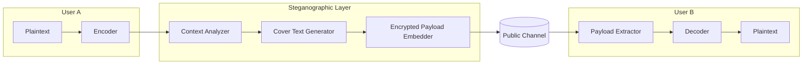
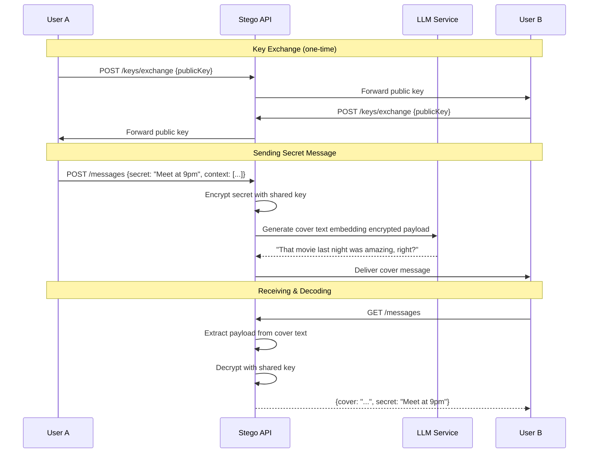

# Steganographic Chat API Design Document

A messaging system where encrypted communications appear as natural, innocent conversations to third parties.

---

## 1. Problem Statement

Design an API that enables secure communication between two parties (User A and User B) where:
- Messages contain hidden encrypted content
- Cover text appears as legitimate, contextual conversation to observers
- Only the intended recipient can decrypt the true meaning
- Bidirectional encryption is supported

---

## 2. System Architecture



---

## 3. Core Components

### 3.1 Key Exchange & Encryption Layer

| Component | Purpose |
|-----------|---------|
| **Session Key Generator** | Creates ephemeral keys per conversation session |
| **Key Exchange Protocol** | Diffie-Hellman or X25519 for establishing shared secrets |
| **Symmetric Encryption** | AES-256-GCM for payload encryption |
| **Message Authentication** | HMAC to ensure integrity |

### 3.2 Steganographic Encoding

Two primary approaches:

#### Approach A: LLM-Based Cover Text Generation
- Use an LLM to generate cover text that embeds encrypted bits
- Control word choice through constrained decoding
- Cover text maintains conversation context

#### Approach B: Format-Preserving Encoding
- Map encrypted bytes to word indices from a predefined codebook
- Select synonyms or sentence variants that encode bit patterns
- Preserve semantic coherence through careful dictionary design

> [!IMPORTANT]
> **Recommended: Approach A (LLM-Based)** provides more natural text and adapts to conversation context dynamically.

### 3.3 Context Manager
- Maintains conversation history (both cover and real)
- Ensures cover text flows naturally for third-party observers
- Provides context to the steganographic encoder

---

## 4. API Design

### 4.1 Endpoints

```
POST /api/v1/sessions
  → Create new encrypted session between two users

POST /api/v1/sessions/{sessionId}/messages
  → Send a steganographically encoded message

GET  /api/v1/sessions/{sessionId}/messages
  → Retrieve and decode messages

POST /api/v1/keys/exchange
  → Initiate key exchange handshake
```

### 4.2 Message Flow



### 4.3 Data Models

```typescript
interface Session {
  id: string;
  participants: [UserId, UserId];
  sharedKeyHash: string;  // For verification only
  coverContext: Message[];
  createdAt: timestamp;
}

interface SendMessageRequest {
  secretMessage: string;
  coverHint?: string;  // Optional: guide cover text topic
}

interface Message {
  id: string;
  sessionId: string;
  coverText: string;      // What third parties see
  encryptedPayload: string;  // Hidden in cover semantics
  timestamp: timestamp;
}

interface DecodedMessage extends Message {
  secretText: string;  // Decrypted true message
}
```

---

## 5. Encoding Strategy (LLM-Based)

### 5.1 Bit Embedding via Constrained Generation

1. **Encrypt** the secret message → binary payload
2. **Chunk** payload into small bit groups (e.g., 2-4 bits each)
3. **Generate** cover text token-by-token:
   - At decision points, let the n-bit chunk determine which candidate token to select
   - Candidate tokens are filtered to maintain coherence
4. **Output** grammatically correct, contextual cover text

### 5.2 Capacity vs. Naturalness Trade-off

| Bits per Token | Capacity | Naturalness |
|----------------|----------|-------------|
| 1 bit | Low | Very high |
| 2 bits | Medium | High |
| 4 bits | High | Moderate |

> [!TIP]
> Start with **2 bits per token** for a balance of payload capacity and text quality.

### 5.3 Decoding Process

1. **Parse** cover text token-by-token
2. **Identify** which candidate was chosen at each decision point
3. **Extract** bits based on token selection
4. **Reconstruct** encrypted payload
5. **Decrypt** with shared key

---

## 6. Security Considerations

| Threat | Mitigation |
|--------|------------|
| Key compromise | Ephemeral session keys + forward secrecy |
| Statistical analysis | Randomize bit embedding positions |
| Replay attacks | Timestamp + nonce in payload |
| Cover text detection | Train on diverse conversation styles |
| Server compromise | End-to-end encryption (server never has plaintext) |

> [!CAUTION]
> The server should **never** have access to plaintexts. All encryption/decryption happens client-side.

---

## 7. Implementation Phases

### Phase 1: Core Infrastructure
- [ ] Key exchange API
- [ ] Session management
- [ ] AES-256-GCM encryption module

### Phase 2: Steganographic Engine
- [ ] LLM integration for cover text generation
- [ ] Bit embedding algorithm
- [ ] Decoding/extraction logic

### Phase 3: Client SDK
- [ ] JavaScript/TypeScript SDK
- [ ] Python SDK
- [ ] End-to-end encryption helpers

### Phase 4: Hardening
- [ ] Statistical analysis resistance
- [ ] Multiple cover text styles
- [ ] Plausible deniability features

---

## 8. Example Interaction

**Secret message from Alice:** `"Meet at the warehouse at midnight"`

**Cover conversation seen by third parties:**

| Sender | Cover Text |
|--------|------------|
| Alice | "Did you catch that documentary about penguins last night?" |
| Bob | "Yeah! The part about their migration was incredible." |
| Alice | "I know right? We should plan a trip to see them someday." |

**Alice's hidden message extracted by Bob:** `"Meet at the warehouse at midnight"`

---

## 9. Open Questions for Review

1. **Cover text topics** – Should users provide topic hints, or should the system auto-generate based on conversation history?

2. **Payload size limits** – What's the maximum secret message length per cover message?

3. **Deniability features** – Should we support multiple decryption keys yielding different plaintexts (for plausible deniability)?

4. **Persistence** – Should conversation history be stored server-side (encrypted) or purely client-side?

5. **LLM choice** – Self-hosted model (privacy) vs. cloud API (convenience)?
