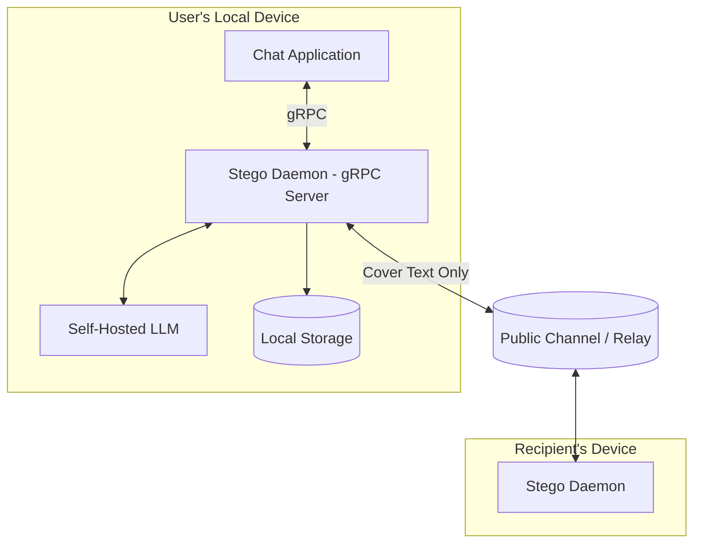
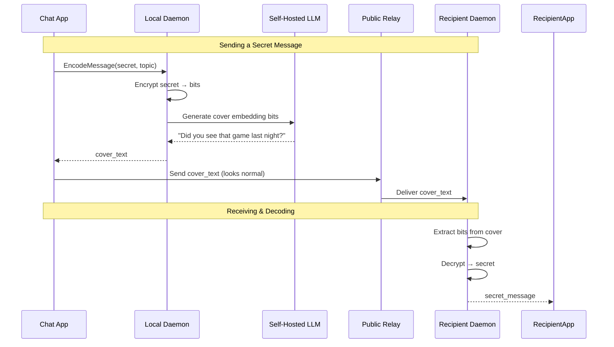
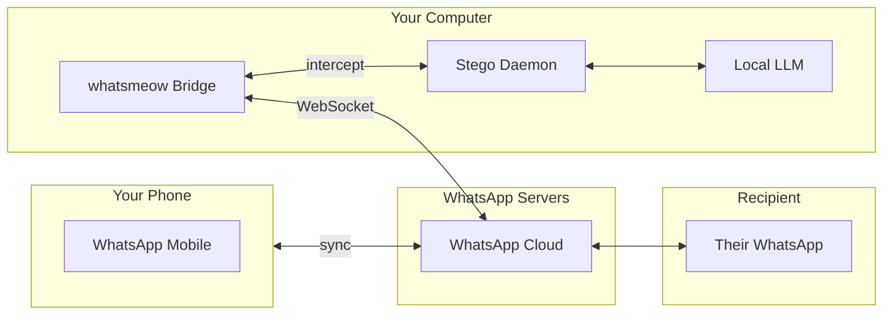
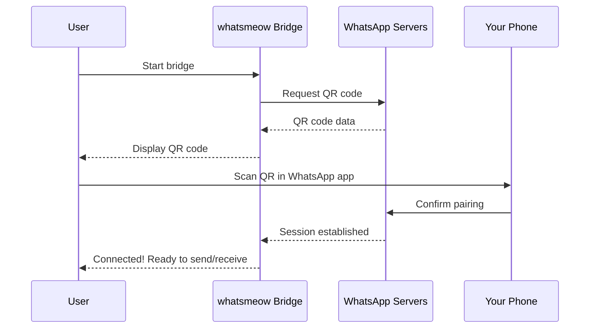

# Steganographic Chat System — Implementation Plan

A local-first messaging system where encrypted communications appear as natural conversations to third parties, using LLM-based steganography.

---

## 1. Problem Statement

Design a **local daemon/bot** that enables secure communication between two parties where:
- Messages contain hidden encrypted content
- Cover text appears as legitimate, contextual conversation to observers
- Only the intended recipient can decrypt the true meaning
- Both parties can send and receive encrypted messages (symmetric roles)
- All encryption/decryption happens **client-side** — no plaintext ever leaves the device

---

## 2. Architecture Overview



### Key Design Decisions

| Aspect | Decision |
|--------|----------|
| **API Protocol** | gRPC (local daemon) |
| **Crypto Location** | Client-side only |
| **Steganography** | LLM-based constrained decoding |
| **LLM Hosting** | Self-hosted model |
| **Persistence** | Client-side only |
| **Deniability** | Multiple decryption keys supported |
| **Cover Topics** | User-provided per message |

---

## 3. Core Components

### 3.1 Key Exchange & Encryption Layer

| Component | Purpose |
|-----------|---------|
| **Session Key Generator** | Creates ephemeral keys per conversation |
| **Key Exchange** | X25519 for establishing shared secrets |
| **Symmetric Encryption** | AES-256-GCM for payload |
| **Deniable Encryption** | Support for decoy keys that yield different plaintexts |

### 3.2 Deniable Encryption Scheme

Support **plausible deniability** with multiple key layers:

```
Primary Key → Real secret message
Decoy Key 1 → Innocent message A  
Decoy Key 2 → Innocent message B
```

If coerced, user can reveal a decoy key that decrypts to a harmless message.

### 3.3 Self-Hosted LLM

Recommended models for local hosting:
- **Llama 3.1 8B** — Good balance of quality and speed
- **Mistral 7B** — Fast inference, solid text quality
- **Phi-3** — Smaller footprint for constrained devices

Serving options:
- **llama.cpp** — CPU-friendly, easy setup
- **Ollama** — Simple API wrapper
- **vLLM** — High throughput for GPU setups

---

## 4. gRPC API Design

### 4.1 Service Definition

```protobuf
syntax = "proto3";
package stego.v1;

service StegoService {
  // Session management
  rpc CreateSession(CreateSessionRequest) returns (Session);
  rpc GetSession(GetSessionRequest) returns (Session);
  
  // Key exchange
  rpc InitiateKeyExchange(KeyExchangeRequest) returns (KeyExchangeResponse);
  rpc CompleteKeyExchange(KeyExchangeRequest) returns (KeyExchangeResponse);
  
  // Messaging
  rpc EncodeMessage(EncodeMessageRequest) returns (EncodeMessageResponse);
  rpc DecodeMessage(DecodeMessageRequest) returns (DecodeMessageResponse);
  
  // Deniability
  rpc AddDecoyKey(AddDecoyKeyRequest) returns (AddDecoyKeyResponse);
}
```

### 4.2 Message Types

```protobuf
message EncodeMessageRequest {
  string session_id = 1;
  string secret_message = 2;       // Max ~30 chars recommended
  string topic_hint = 3;           // User-provided cover topic
  optional string decoy_message = 4;  // For deniability
}

message EncodeMessageResponse {
  string cover_text = 1;           // Natural-looking text to send
  bytes encrypted_payload = 2;     // For debugging/verification
  int32 bits_encoded = 3;
}

message DecodeMessageRequest {
  string session_id = 1;
  string cover_text = 2;
  optional bytes decoy_key = 3;    // If using deniable decryption
}

message DecodeMessageResponse {
  string secret_message = 1;
  bool is_decoy = 2;              // True if decoy key was used
}
```

### 4.3 Local Daemon Flow



---

## 5. LLM-Based Encoding Strategy

### 5.1 Bit Embedding via Constrained Generation

**Example: Encoding `01 10 11 00`**

1. LLM generates candidates for next token: `["the", "a", "that", "this"]`
2. Map to bit patterns: `the=00, a=01, that=10, this=11`
3. Bits to encode: `01` → force selection of `"a"`
4. Repeat for each position

**Prompt to LLM:**
```
Continue this casual conversation about {topic}:

User A: Hey, how's it going?
User B: Pretty good! {continue naturally...}
```

The constrained decoder overrides normal sampling to pick tokens matching the bit pattern.

### 5.2 Capacity Analysis

| Parameter | Value |
|-----------|-------|
| Bits per token | 3 (8 candidates per decision) |
| Secret message limit | ~30 characters |
| Bits to encode | 30 chars × 8 bits = 240 bits |
| + AES overhead | ~128 bits (simplified) |
| Total bits | ~370 bits |
| Cover text tokens | 370 ÷ 3 ≈ **125 tokens (~90 words)** |

> [!TIP]
> For shorter cover texts (~50 words), limit secrets to **15-20 characters** or use **4 bits/token** with slight naturalness trade-off.

### 5.3 Decoding Process

1. Tokenize cover text using same tokenizer as encoder
2. For each token, determine its index among candidates
3. Extract n-bit pattern from index
4. Reassemble encrypted payload
5. Decrypt with shared key (or decoy key)

---

## 6. Security Considerations

| Threat | Mitigation |
|--------|------------|
| Key compromise | Ephemeral session keys + forward secrecy |
| Statistical analysis | Randomize embedding positions, vary topic |
| Coercion | Deniable encryption with decoy keys |
| LLM fingerprinting | Use common models, add randomness |
| Local storage breach | Encrypt local DB with device key |

> [!CAUTION]
> All plaintexts stay local. The daemon **never** sends unencrypted secrets over the network.

---

## 7. Implementation Phases

### Phase 1: Core Infrastructure
- [ ] gRPC service skeleton (Rust or Go)
- [ ] X25519 key exchange
- [ ] AES-256-GCM encryption module
- [ ] Local SQLite storage (encrypted)

### Phase 2: LLM Integration
- [ ] Ollama/llama.cpp integration
- [ ] Constrained decoding implementation
- [ ] Bit embedding algorithm
- [ ] Decoding/extraction logic

### Phase 3: Deniable Encryption
- [ ] Multi-key encryption scheme
- [ ] Decoy message support
- [ ] Coercion-resistant key structure

### Phase 4: Client Apps
- [ ] CLI tool (Go/cobra) — dev/testing only
- [ ] Simple web UI (local)
- [ ] Integration examples

### Phase 5: WhatsApp Integration
- [ ] whatsmeow bridge setup
- [ ] Message interception layer
- [ ] Auto-encode outgoing / auto-decode incoming
- [ ] QR code pairing flow

### Phase 6: Hardening & Demo
- [ ] Statistical analysis resistance testing
- [ ] Multiple cover text styles
- [ ] Deploy self-hosted LLM for online demo

---

## 8. WhatsApp Integration

### 8.1 Overview

Use [whatsmeow](https://github.com/tulir/whatsmeow) — a Go library that connects to WhatsApp Web — to intercept and transform messages.



### 8.2 How It Works

**Sending (Your Message):**
1. You type secret message in a local UI or CLI
2. Daemon encodes secret → cover text via LLM
3. Bridge sends cover text to WhatsApp contact
4. Recipient sees normal-looking message

**Receiving (Their Message):**
1. Bridge receives incoming WhatsApp message
2. Daemon attempts to decode hidden payload
3. If valid stego message → show decrypted secret
4. If normal message → pass through unchanged

### 8.3 Setup Flow



### 8.4 Message Flow with WhatsApp

| Action | Flow |
|--------|------|
| **Send secret** | You → Daemon (encode) → Bridge → WhatsApp → Recipient |
| **Receive secret** | Sender → WhatsApp → Bridge → Daemon (decode) → You |
| **Normal send** | You → Bridge → WhatsApp → Recipient (bypass daemon) |
| **Normal receive** | Sender → WhatsApp → Bridge → You (no decoding) |

### 8.5 Implementation Notes

```go
// Pseudo-code for WhatsApp bridge integration
import "go.mau.fi/whatsmeow"

func onOutgoingMessage(msg string, contact string) {
    // Check if user wants to send encrypted
    if isSecretMode(contact) {
        encoded := daemon.EncodeMessage(msg, getTopic())
        client.SendMessage(contact, encoded.CoverText)
    } else {
        client.SendMessage(contact, msg)
    }
}

func onIncomingMessage(evt *events.Message) {
    // Try to decode - if fails, it's a normal message
    decoded, err := daemon.DecodeMessage(evt.Message.GetConversation())
    if err == nil {
        showSecretMessage(evt.Info.Sender, decoded.SecretMessage)
    } else {
        showNormalMessage(evt)
    }
}
```

### 8.6 Limitations

| Limitation | Notes |
|------------|-------|
| **Requires active session** | Bridge must stay running to send/receive |
| **One phone per bridge** | WhatsApp allows only one web session per phone (unless multi-device beta) |
| **No media (initially)** | Start with text only; image stego is future work |
| **Rate limits** | WhatsApp may flag unusual patterns; keep message frequency natural |

> [!WARNING]
> WhatsApp's Terms of Service prohibit automated messaging. This is for personal/educational use only.

---

## 9. Example Interaction

**Setup:**
- Secret: `"Dock 7, 9pm"`  (12 chars)
- Topic hint: `"weekend plans"`
- Bits per token: 3

**Encoding:**
```
User: EncodeMessage(secret="Dock 7, 9pm", topic="weekend plans")
Daemon: {
  cover_text: "I was thinking of checking out that new pizza 
               place on Saturday. Heard they have amazing crust.
               Want to join around dinner time?",
  bits_encoded: 280
}
```

**What observers see:** A normal conversation about weekend plans.

**Decoding by recipient:**
```
Recipient: DecodeMessage(cover_text="I was thinking...")
Daemon: {
  secret_message: "Dock 7, 9pm",
  is_decoy: false
}
```

**If coerced — using decoy key:**
```
Coerced: DecodeMessage(cover_text="...", decoy_key=<key>)
Daemon: {
  secret_message: "See you Saturday!",
  is_decoy: true
}
```

---

## 10. Technology Stack

| Component | Technology |
|-----------|------------|
| Daemon | Go + gRPC |
| Encryption | golang.org/x/crypto (nacl, chacha20poly1305) |
| LLM Serving | Ollama + Llama 3.1 8B |
| Local Storage | SQLite + go-sqlcipher |
| CLI (dev) | cobra |

---

## 11. Open Items Resolved

| Question | Resolution |
|----------|------------|
| Cover topics | User-provided per message |
| Payload limits | ~30 chars for ~90 word cover; ~15 chars for ~50 words |
| Deniability | Yes — multiple decryption keys |
| Persistence | Client-side only (encrypted SQLite) |
| LLM hosting | Self-hosted (Ollama + Llama 3.1) |
| API style | gRPC local daemon |

---

## 12. Next Steps

1. **Confirm technology choices** (Rust vs Go for daemon)
2. **Set up Ollama** with Llama 3.1 8B locally
3. **Prototype** the constrained decoding algorithm
4. **Build** gRPC skeleton with key exchange
